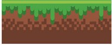

# Platform Runner

> In this game, your goal is to collect as many points as possible before you fall from the platform or hurt yourself from the spikes

## Game Design

### Concept

- Your goal is to collect gold as much as possible and
- Try to not miss in jumping platforms
- Avoid game killers(spikes)

### Controls

You need a keyboard to control the panda.

- Press ⬆️ to jump.
- Press ➡️ to go right.
- Press ⬅️ to go left.

### Assets

|Asset                                      |Description                            |
|-------------------------------------------|---------------------------------------|
|           |Dude spritesheet to animate the player |
|      |Platform that the player can jump on   |
||Background image                       |
|       |Gold coins for collection              |
|        |Spikes that the player needs to avoid  |

## Built With

- Javascript
- Phaser
- Webpack, Babel and Jest

## Live Demo

[screenshot](https://nifty-hawking-f25f2d.netlify.app/)

## Getting Started

To get a local copy up and running follow next steps

### Prerequisites

- Node.js
- npm

### Setup

Run `git@github.com:GzimAsani/Platform-Runner.git` or `https://github.com/GzimAsani/Platform-Runner.git` in your terminal to clone this repo

### Install

Install the necesarry dependencies by running `npm install` in the root of cloned repo.

### Usage

Run `npm start` to view the game in your default browser.

### Testing

Run `npm test` to run the tests.

## Authors
